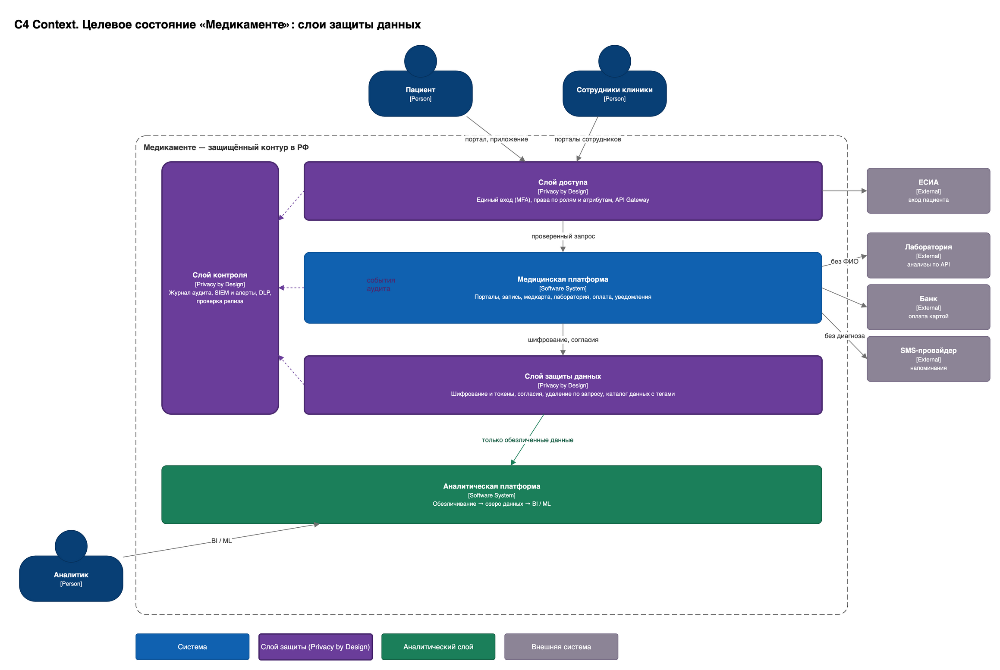

# Задание 2. Проектирование решения (Privacy by Design)

| Файл | Содержание |
|---|---|
| [C4-context-target.drawio](C4-context-target.drawio) ([png](C4-context-target.drawio.png)) | **C4 Level 1 — System Context** целевого состояния. Новые системы, сквозной слой Privacy & Security Platform, аналитическая платформа, внешние участники |
| [C4-container-target.drawio](C4-container-target.drawio) ([png](C4-container-target.drawio.png)) | **C4 Level 2 — Container**. Детализация до контейнеров. Контейнеры **MVP** выделены оранжевой рамкой |



## 1. Подход

Privacy by Design встроен в архитектуру как **отдельный сквозной слой** (фиолетовые блоки), а не как набор доработок в каждом сервисе. Так выполняется требование бизнеса: *«выстроить такой подход к работе с данными по умолчанию, чтобы новые интеграции не приходилось перевалидировать»*. Новый сервис или партнёр автоматически получает:

- аутентификацию и авторизацию через IAM + OPA;
- шифрование своих C3/C4-полей ключами из Vault;
- проверку согласий через Consent Service;
- журналирование через Audit Log;
- контроль тегов в CI через Privacy Gate.

Как принципы PbD отражены в архитектуре:

| Принцип PbD | Как реализован |
|---|---|
| Проактивность | Privacy Gate в CI/CD, модель угроз, UEBA-алерты до инцидента |
| Privacy by Default | Deny-by-default в OPA, маскирование по тегу по умолчанию, минимальная анкета, отдельные согласия по целям |
| Встроенность в дизайн | Теги классификации в схемах БД, API и событий; PbD-сервисы — часть платформы |
| Positive-sum | Автоматизация (запись, напоминания, ЛК) и защита — одно решение, без двойного учёта |
| End-to-end security | TLS / mTLS, шифрование at rest + field-level, crypto-shredding, retention по тегам |
| Прозрачность | Data Catalog + Lineage, журнал аудита, пациент видит свои данные и согласия в ЛК |
| Уважение к субъекту | ЛК, отзыв согласия в один клик, запрос на удаление или выгрузку (152-ФЗ ст. 14, 21) |

## 2. Новые блоки Privacy by Design

| Блок | Технология | Функция | Какую проблему закрывает |
|---|---|---|---|
| **IAM** | Keycloak (realm `patients` и `staff`, федерация с AD, OTP / ЕСИА, MFA) | Единая аутентификация, персональные учётки, SSO | доступ не разграничен, вход по паролю |
| **Policy Engine** | OPA (Rego, policy-as-code в Git) | RBAC + ABAC-решение на каждый запрос (PDP); PEP — в API Gateway и сервисах | доступ к любой медкарте |
| **Vault + HSM** | HashiCorp Vault / OpenBao (Transit, Transform, PKI), HSM / СКЗИ | Ключи KEK/DEK, envelope encryption, токенизация, секреты, ротация | открытые файлы, один сервер |
| **Tokenization / Pseudonymization** | Vault Transform + token store | `patient_token`, `order_id`, `episode_token` вместо ФИО в неклинических доменах | ФИО в платежах и у лаборатории |
| **Consent Service** | Java + Postgres | Согласия по целям (лечение, уведомления, маркетинг, передача партнёрам) с версией текста и сроком; отзыв → событие `consent.revoked` | отзыв согласия не учитывается |
| **Privacy Requests & Retention** | Java + Kafka | Запросы субъекта (доступ, исправление, удаление, выгрузка), SLA 10 рабочих дней; удаление по сроку из тега `retention`; crypto-shredding | нельзя удалить по запросу |
| **Data Catalog + Lineage** | OpenMetadata | Словарь тегов, автоклассификация PII, владельцы доменов, Lineage от источника до витрины | нет классификации и Lineage |
| **Audit Log Service** | Java → ClickHouse (append-only, WORM, TTL по закону) | Кто, что, когда, зачем читал или менял; основа для UEBA | нет журнала доступа |
| **SIEM + UEBA** | Wazuh / MaxPatrol SIEM + правила на ClickHouse | Корреляция, аномалии (массовый просмотр карт, ночной доступ, break-glass), инциденты → уведомление РКН за 24/72 ч | инциденты не замечаются |
| **DLP** | InfoWatch Traffic Monitor / Solar Dozor | Контроль USB, печати, почты, мессенджеров на АРМ | бесконтрольные копии |
| **Privacy Gate (CI/CD)** | OPA Conftest, Spectral (OpenAPI), Semgrep, Gitleaks | Релиз не проходит, если поле без тега или C4 уходит в партнёрский контракт; метрики → VictoriaMetrics | требование финального состояния |
| **Service Mesh + PKI** | Istio / Linkerd + cert-manager | mTLS между сервисами, NetworkPolicy, zero trust | плоская сеть |
| **ГОСТ VPN / NGFW** | ViPNet Coordinator / Континент | Филиалы, сегментация, изолированный VLAN ККТ | плоская сеть |
| **Partner API Gateway** | Envoy / Kong | Отдельный периметр для партнёров: mTLS + OAuth2 client credentials, scopes, фильтрация полей по тегам, защита от BOLA | избыточные данные партнёру |

## 3. Аналитический слой с учётом Privacy by Design

В аналитику нет прямого доступа к операционным БД. Данные попадают туда только через **Privacy Pipeline**, и правила обезличивания берутся из тегов каталога.

```
Операционные БД ──CDC (Debezium)──► Kafka ──► Privacy Pipeline ──► L1 Curated (MinIO+Iceberg, псевдонимизировано)
Архив Excel ──PII-сканер──────────────────┘        │  ▲                     │
                                                   │  └─ теги/правила (OpenMetadata), HMAC-ключ (Vault)
                                                   └──► L0 Raw (restricted, TTL 14 дней, только pipeline)
L1 ──► L2 Витрины ClickHouse (агрегаты, k ≥ 5, RLS по филиалу) ──► BI (Superset)
L1 ──► ML / LLM sandbox (JupyterHub, on-prem LLM, без выгрузки) ;  Re-identification — только по заявке, одобряет DPO
```

Правила обезличивания в Privacy Pipeline:

- **Прямые идентификаторы** (ФИО, телефон, email, паспорт) удаляются. `patient_key = HMAC(patient_id, ключ аналитики)` — ключ отдельный от операционного и ротируется.
- **Квазиидентификаторы** обобщаются:
  - дата рождения → возрастная группа;
  - адрес → город / район;
  - дата визита → неделя.
- Проверяется **k-анонимность** (k ≥ 5); редкие комбинации подавляются.
- **Свободный текст** (жалобы, заключения) для LLM проходит NER-редакцию русскоязычных ПДн (Natasha / Presidio с русскими моделями). LLM развёрнута on-prem или в облаке в РФ; промпты и ответы проходят PII-фильтр.
- В Lineage фиксируются **цель обработки** и потребители (152-ФЗ ст. 5 ч. 2).

## 4. Категории данных пациентов, домены и права доступа (MVP и финал)

### 4.1 Разнесение категорий по доменам

| Домен (владелец данных) | Сервис | Категории данных | Класс | Этап |
|---|---|---|---|---|
| **Identity** | Patient Registry (MPI) | ФИО, дата рождения, пол, телефон, email; паспорт / СНИЛС / полис — только токены | C3 / C4 | MVP |
| **Scheduling** | Scheduling | `patient_token`, врач, специальность, филиал, слот, статус записи | C3 (косвенно C4: специальность) | MVP |
| **Notification** | Notification | Контакт получает только на время отправки (детокенизация); шаблоны без медсведений | C3 | MVP |
| **Consent** | Consent Service | Согласия, цели, сроки, отзывы | C3 | MVP |
| **Clinical** | EHR | Анамнез, хронические заболевания, диагнозы, заключения, назначения, сканы | C4 | финал |
| **Lab** | Lab Integration | Заказы (`order_id`), результаты | C4 | финал |
| **Billing** | Billing + Payment | Счета (коды услуг), платежи, `patient_token` | C2 | финал |
| **CRM** | CRM | Предпочтения и коммуникации — только при согласии «маркетинг» | C3 | финал |
| **HR** | 1С:ЗУП | ПДн сотрудников, мед. книжки | C3 / C4 | финал |
| **Analytics** | Data Platform | Псевдонимизированные и агрегированные данные | C1–C2 | финал |

### 4.2 Роли (RBAC) и атрибуты (ABAC)

ABAC-атрибуты, которые OPA получает из токена и контекста:

- `sub` / `patient_id` — кто пациент;
- `role`;
- `branch_id` — филиал сотрудника и филиал записи;
- `treating` — есть ли у врача активная запись или эпизод с этим пациентом в окне −1…+30 дней;
- `consent.*` — действующие согласия;
- `purpose` — цель запроса;
- `shift` — рабочая смена;
- `break_glass` — экстренный доступ с обоснованием.

Обозначения: **RW** — чтение и запись, **R** — чтение, **M** — только маскированный вид, **—** — нет доступа.

| Роль | Identity (контакты) | Идентиф. документы | Scheduling | Clinical (EHR) | Lab | Billing | Consent | Analytics |
|---|---|---|---|---|---|---|---|---|
| Пациент | RW **свои** (`patient_id = sub`) | R свои (маска) | RW свои записи | R свои заключения | R свои результаты | R свои счета | RW свои | — |
| Ресепшен | M, RW при регистрации; `branch_id` | R (маска, сверка `verified`) | RW записи **своего филиала** | — | — (только статус «готов») | R статус оплаты | R | — |
| Медицинский специалист | R пациентов с `treating = true` | — | R своё расписание | RW при `treating = true`; иначе break-glass | R при `treating = true`; RW назначения | — | R | — |
| Кассир | M; `branch_id` | — | R факт приёма | — | — | RW платежи своей смены | — | — |
| Бухгалтер | — | — | — | — | — | R (без `patient_token` → только агрегаты и договоры) | — | R финансовые витрины |
| HR-специалист | — (домен HR отдельно) | — | — | — | — | — | — | — |
| Аналитик | — | — | — | — | — | — | — | R L1 / L2 (псевдонимизированные); `purpose` обязателен |
| Руководитель филиала | — | — | R агрегаты своего филиала | — | — | R агрегаты | — | R дашборды `branch_id` |
| Сервис Notification | R контакт (детокенизация) только при `consent.notifications` | — | R `reminder.due` | — | — | — | R | — |
| Партнёр-лаборатория | — | — | — | — | RW только **свои** `order_id` (scope `lab.results:write`) | — | — | — |
| DPO / офицер ИБ | R по заявке (журналируется) | — | R | break-glass-аудит | — | — | RW | R lineage |
| Администратор платформы | — (инфраструктура без доступа к данным; PAM, 4 глаза) | — | — | — | — | — | — | — |

Пример ABAC-политики (Rego):

```rego
package ehr.authz
default allow := false

allow if {                                   # лечащий врач
  input.subject.role == "doctor"
  input.action in {"read", "write"}
  data.treating[input.subject.id][input.resource.patient_id]
  input.subject.branch_id == input.resource.branch_id
}
allow if {                                   # пациент — только свои данные
  input.subject.role == "patient"
  input.action == "read"
  input.subject.patient_id == input.resource.patient_id
}
allow if {                                   # break-glass: разрешено, но с алертом
  input.subject.role == "doctor"
  input.context.break_glass.reason != ""
}
```

## 5. MVP (через ~2 месяца) и финальное состояние (через год)

**MVP** — контейнеры с оранжевой рамкой на Container-диаграмме:

- портал пациента (запись без ЛК-медданных);
- портал ресепшена;
- WAF + API Gateway;
- Patient Registry;
- Scheduling;
- Notification (SMS / email за день до приёма пациенту, специалисту — список в портале);
- Kafka;
- Keycloak, OPA, Vault, Consent, Audit Log, Service Mesh.

То есть **PbD-минимум входит в MVP с первого дня**: без него портал с ПДн запускать нельзя.

**Финальное состояние**, дополнительно к MVP:

- мобильное приложение и голосовой робот (подтверждение или отмена → событие на ресепшен);
- EHR и АРМ врача;
- интеграция с лабораторией через Partner API;
- платёжный шлюз и CRM;
- Privacy Requests & Retention;
- Data Catalog, Privacy Gate, SIEM + UEBA, DLP;
- аналитическая платформа.

## 6. Соответствие НФТ

| НФТ | Решение |
|---|---|
| Безопасность (конфиденциальность) | Слой PbD; шифрование at rest / in transit; RBAC + ABAC; аудит; своевременное удаление (Retention, crypto-shredding); остановка обработки по `consent.revoked` / `privacy.erase` |
| Масштабируемость | Stateless-сервисы в Kubernetes (HPA), Kafka для асинхронных уведомлений, Postgres с репликами, ClickHouse для аналитики и аудита; филиалы подключаются через ГОСТ VPN к единому контуру, без копий данных |
| Сопровождаемость | Доменные сервисы с чёткими границами, контракты OpenAPI / Avro с тегами, IaC (Helm, Terraform), единая наблюдаемость (VictoriaMetrics, Grafana, Elastic) |
| Конфигурируемость | Политики доступа — Rego в Git (без перекомпиляции); правила маскирования и обезличивания — из тегов каталога; шаблоны уведомлений и сроки хранения — конфигурация; feature flags |
