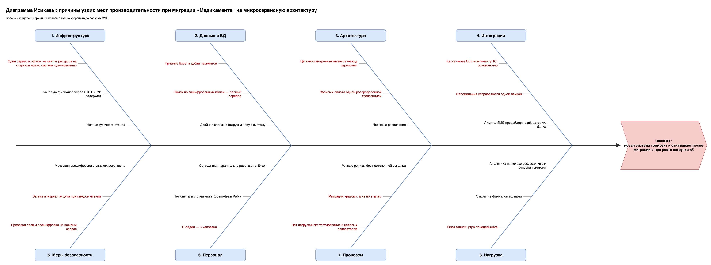

# Задание 4. Узкие места при миграции

Диаграмма Исикавы: [ishikawa-migration-bottlenecks.drawio](ishikawa-migration-bottlenecks.drawio) ([png](ishikawa-migration-bottlenecks.drawio.png))

## 1. Что мигрируем

| Сейчас | Целевое состояние |
|---|---|
| Excel и сканы на общем диске | Сервисы в Kubernetes со своими базами Postgres |
| 1С в файловом режиме | 1С в клиент-серверном режиме, обмен через адаптер |
| Касса связана с 1С через OLE | Касса и платёжный шлюз с отдельной фискализацией |
| Один сервер в офисе | Облако в РФ, филиалы через ГОСТ VPN |
| Защиты нет | Слои защиты: вход, права, шифрование, аудит |

Сильнее всего миграция затрагивает запись на приём, напоминания, оплату и перенос данных: там пики нагрузки, внешние системы и строгие требования к времени ответа.

## 2. Причины узких мест

| Категория | Причина | Как повлияет на производительность |
|---|---|---|
| Инфраструктура | Один сервер в офисе | На время перехода не хватит ресурсов на старую и новую систему сразу |
| | Канал до филиалов через ГОСТ VPN | Медленные порталы и таймауты у касс в филиалах |
| | Нет нагрузочного стенда | Узкие места найдутся только у пользователей |
| Данные и БД | Грязные Excel, дубли пациентов | Долгая миграция, медленный и ошибочный поиск пациента |
| | Поиск по зашифрованным полям | Каждый поиск на ресепшене перебирает всю таблицу |
| | Двойная запись в старую и новую систему | Расхождения данных, ручные сверки |
| Архитектура | Цепочки синхронных вызовов между сервисами | Задержки складываются, при нагрузке растут непропорционально |
| | Запись и оплата одной распределённой транзакцией | Блокировки, таймауты, «зависшие» слоты |
| | Нет кэша расписания | Лишняя нагрузка на базу при каждом просмотре |
| Интеграции | Касса через OLE-компоненту 1С | Однопоточно: очередь на кассе, оплата встаёт при сбое 1С |
| | Напоминания отправляются одной пачкой | Пик нагрузки на сервис уведомлений и SMS-провайдера |
| | Лимиты SMS-провайдера, лаборатории, банка | Отказы и недоставленные напоминания |
| Меры безопасности | Проверка прав и расшифровка на каждый запрос | Дополнительная задержка на каждом вызове |
| | Запись в журнал аудита при каждом чтении | Объём записи в журнал в разы больше самих запросов |
| | Массовая расшифровка в списках ресепшена | Сотни обращений к Vault на один экран |
| Персонал | IT-отдел — 3 человека | Медленный разбор инцидентов |
| | Нет опыта эксплуатации Kubernetes и Kafka | Ошибки настройки, долгое восстановление |
| | Сотрудники параллельно работают в Excel | Двойная запись, недоверие к системе |
| Процессы | Нет нагрузочного тестирования и целевых показателей | Непонятно, готова ли система к запуску |
| | Миграция «разом», а не по этапам | Вся нагрузка сразу на незрелую систему, откатиться нельзя |
| | Ручные релизы без постепенной выкатки | Ошибка сразу затрагивает всех пользователей |
| Нагрузка | Пики записи (утро понедельника) | Всплеск запросов, гонка за слоты |
| | Открытие филиалов волнами | Скачкообразный рост пользователей и данных |
| | Аналитика на тех же ресурсах | Тяжёлые запросы тормозят запись и оплату |

## 3. Меры и приоритеты

Приоритет:
- **высокий** — сделать до запуска MVP;
- **средний** — до открытия второго филиала;
- **низкий** — к финальному состоянию.

| Мера | Что устраняет | Приоритет |
|---|---|---|
| Мигрировать по этапам: сначала запись, потом медкарта, лаборатория, оплата. Excel перевести в режим только для чтения | Миграция «разом», двойная запись, работа в Excel | Высокий |
| Нагрузочные тесты под рост ×5 и пики. Целевые показатели: запись быстрее 0,5 с, доступность 99,9 % | Нет тестирования и стенда, пики записи | Высокий |
| Перенести систему в облако в РФ, завести отдельный нагрузочный стенд | Один сервер, нет стенда | Высокий |
| Запись и оплату связать через события, а не одну транзакцию | Распределённая транзакция | Высокий |
| Рассылать напоминания порциями в течение дня, соблюдать лимиты провайдера | Пачка напоминаний, лимиты | Высокий |
| Проверять права локально у сервиса, расшифровывать пакетами, искать по хешу поля | Проверки на каждый запрос, поиск по шифру, массовая расшифровка | Высокий |
| Писать журнал аудита асинхронно и пачками | Нагрузка от аудита | Высокий |
| Очистить данные и убрать дубли пациентов до миграции | Грязные Excel | Высокий |
| Нанять DevOps / SRE, администратора БД и специалиста ИБ | Маленькая команда, нет опыта | Высокий |
| Перевести кассу на сетевой драйвер, отправлять данные в 1С через очередь | Касса через OLE | Высокий |
| Кэшировать расписание | Нет кэша | Средний |
| Объединить цепочки вызовов в один агрегирующий запрос | Цепочки синхронных вызовов | Средний |
| Повторять запросы к внешним API с паузой и ограничивать поток | Лимиты внешних систем | Средний |
| Заложить резервный канал для филиалов и план ресурсов под каждое открытие | VPN, волны филиалов | Средний |
| Выкатывать релизы постепенно, с автоматическим откатом | Ручные релизы | Средний |
| Вынести аналитику на отдельные ресурсы | Аналитика на общих ресурсах | Низкий |

## 4. Вывод

Главные риски для производительности:
1. **Способ миграции.** Переход «разом» и двойная запись. Решение — поэтапный переход.
2. **Незрелая эксплуатация.** Нет нагрузочных тестов, целевых показателей и людей. Решение — тестирование и найм.
3. **Накладные расходы новых мер защиты.** Проверки, шифрование и аудит на каждом запросе. Решение — локальные проверки, пакетная обработка, асинхронный аудит.

Меры с высоким приоритетом нужно выполнить до запуска MVP. Иначе система не выдержит первого пика записи.
